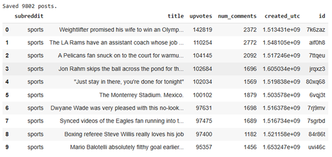
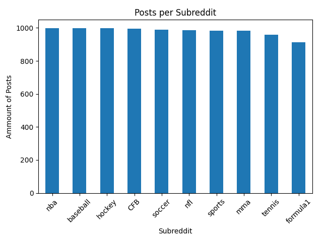
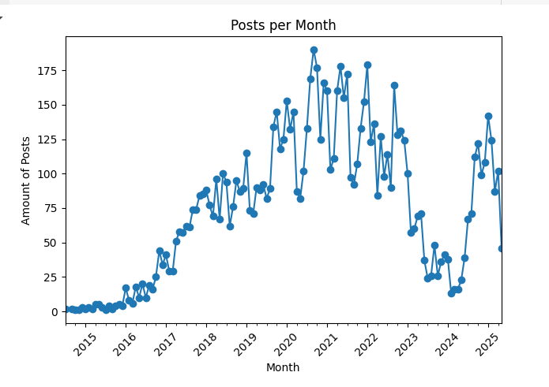
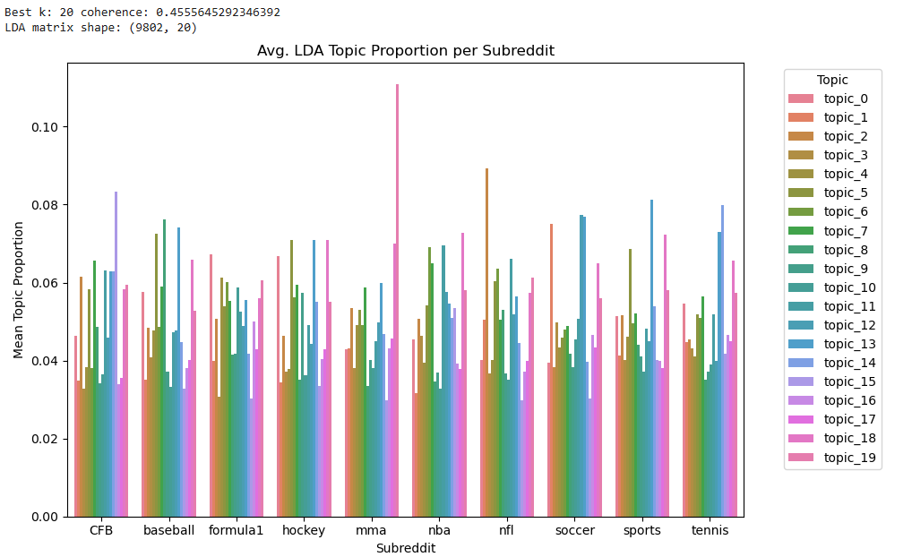
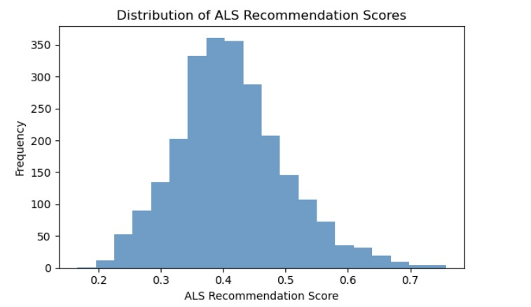
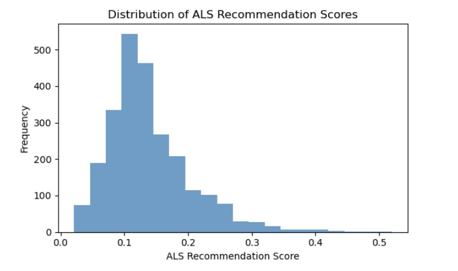

# Final-Project-Machine-Learning-Applications

  

100499170: Pablo Ruiz Torralba

100496380: Jesús Navarro Benito 

100466636: Jason Nzondomyo Ngalambude

## 1. Introduction

In this project, we aim to analyze and understand the thematic structure and popularity patterns of Reddit posts related to sports. Reddit, as one of the most widely used platforms for online discussion, offers great user-generated content across numerous communities (subreddits), particularly those dedicated to sports like football, basketball, or tennis. In order to achieve this, we used some of the tools explained in class about Machine learning tools and Natural Language Processing.

## 2. Task 1: Text Preprocessing and vectorization

#### 2.1 The dataset
To build our dataset, we used the PRAW (Python Reddit API Wrapper) library to collect the top 1,000 posts from each of ten popular sports-related subreddits: sports, soccer, nba, nfl, baseball, hockey, mma, formula1, tennis, and CFB. For each post, we extracted metadata including the subreddit name, post title, number of upvotes, number of comments, post ID, and creation timestamp. Since the main focus of our project is based on the title text, we discarded other fields like the post body, which were often missing or empty.

The resulting dataset contains around 10,000 posts and was saved in CSV format for processing later.

  

We can also check the distribution per sport, so each sport contains around 1000 posts as mentioned before.

  

Finally, we will plot a graph to see the posts per month in our csv file.

  

We observe that from 2020 to 2022 and in 2025 are the years with most tweets, which we could take into account for the observation in the dashboard later as we have used dates for different visualizations.

#### 2.2 Preprocessing

**Language Detection**

Before preprocessing the text, we ensured all titles were in English by applying the langdetect library. Titles identified as non-English were filtered out to maintain consistency in the process and in the modeling.

**Text Cleaning and Normalization**

We applied a standard NLP preprocessing pipeline using NLTK, which included:

- Lowercasing all text.

- Removing URLs.

- Tokenizing titles into words.

- Removing stopwords and non-alphabetic tokens.

- Lemmatizing words using WordNet.

This process resulted in a new column clean_title containing the cleaned and normalized version of each title.

#### 2.3 Text Representation and Regression Evaluation

We experimented with four different ways of turning post titles into numerical vectors: TF-IDF, Word2Vec, Doc2Vec, and LDA. These representations were then evaluated by how well they helped a Ridge regression model predict the popularity of a post (measured as log1p(upvotes)) using 5-fold cross-validation.

**Vectorization: TF-IDF Representation**

We used the TfidfVectorizer from scikit-learn to convert the cleaned titles into numerical vectors. This method assigns weights to terms based on their frequency across documents while penalizing overly common terms.We used a TfidfVectorizer with unigrams and bigrams, limiting the vocabulary to words that appear in at least 5 posts but not in more than 70% of them. This resulted in 4,144 features across 9,802 posts.

The matrix is very sparse (~0.20% non-zero values), which is expected for TF-IDF. Analyzing the idf values, the most common words were general sports terms like "game", "team", or "player", while rarer ones included "achilles" or "acquire".

The TF-IDF representation achieved a cross-validated RMSE of 0.9157, which served as our baseline.

**Word2Vec**

We trained a Word2Vec model locally using Gensim with a 400-dimensional embedding space. Each title was represented by averaging the vectors of its words.

Some documents ended up with zero vectors (about 0.6%) because all their words were out-of-vocabulary (too rare). The performance was slightly worse than TF-IDF, with an RMSE of 0.9491 ± 0.4159.

**Doc2Vec**

Unlike Word2Vec, which averages word vectors, Doc2Vec directly learns document-level embeddings. We used the Distributed Memory (DM) variant with 400 dimensions.

This time, no documents had zero vectors, and the representation performed slightly better than the others, reaching an RMSE of 0.8970 ± 0.3992.

**LDA (Latent Dirichlet Allocation)**

For topic modeling, we trained an LDA model using Gensim. After testing several values for the number of topics, we selected k = 20 based on coherence scores. Each title was then represented by a 20-dimensional topic distribution vector.

We also analyzed topic distributions across subreddits to spot differences in thematic focus.

In regression, the LDA representation yielded an RMSE of 0.8626 ± 0.3944, slightly better than Doc2Vec and Word2Vec.

  

We can observe that most of the topics have the same importance for most of the sports. However, we can highlight some of them, like topic 15 for CFB, topic 19 for mma or topic 2 for nfl.

# PONER CONCLUSION PARA ESTOS 4 (IGUAL SE PUEDE AÑADIR ALGUNA FOTO TB)

## 3. Task 2:  Machine Learning model

als scores:

  

als scores with hyperparameters:

  

## 4. Dashboard

In this section, we have developed an interactive Dashboard using Dash. This dashboard includes several interactive components for exploring and analyzing the topics discussed in Reddit posts about sports. Here are the main features:

#### 4.1. Word Cloud for the Selected Date Range
We’ve added a date range selector that lets you choose a specific time period. The word cloud will then generate based on the titles of Reddit posts within that date range. You can also filter the word cloud by sport, allowing you to see how popular words evolve over time within the chosen sport.

#### 4.2. Topic Distribution by Highlighted Event
This section allows you to explore topics related to significant events within a sport. You can select a sport and a major event (we have slected them), and the dashboard will generate a word cloud of the most mentioned words around that event, from the date of the event to two weeks after the event. This feature is useful for analyzing how major events influence the topics discussed by users.

#### 4.3. Topic Distribution by Sport
A dropdown selector allows you to choose a sport (e.g., football, basketball) and view a bar chart showing the distribution of topics (LDA) that are most prominent in Reddit posts related to that sport. This chart helps visualize how certain topics are more common in specific sports, which is useful for understanding trends and user interests in different sports.

#### 4.4. Evolution of Popularity for Famous Athletes
We have included a graph showing the monthly evolution of mentions for famous athletes on Reddit. You can select one or more athletes (e.g., Messi, LeBron James - we added 3 important athletes for each sport), and the graph will show how their mentions have changed month by month. This chart helps visualize fluctuations in user interest over time for different athletes. 

## 5. Conclusions

## 6. References
